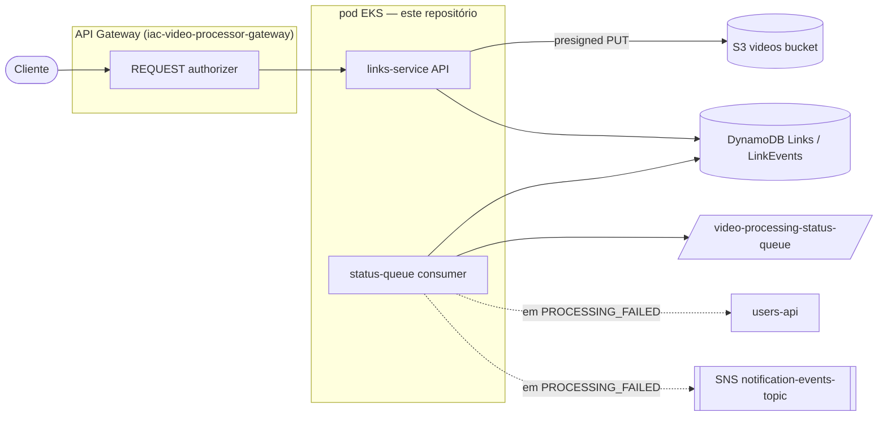

# links-service

API HTTP do domínio de **links** do Tech Challenge FIAP X (Fase 5 — Hackathon, 13SOAT). Fonte única da verdade do domínio (ADR-007): cria o link, gera a presigned URL de upload, aplica a máquina de estados, persiste em DynamoDB (`Links`/`LinkEvents` com TTL nativo de 3 dias), consome continuamente a `video-processing-status-queue` e publica no `notification-topic` quando o processamento falha (ADR-008).

Repositório correspondente na organização: [`video-processor-link-api`](https://github.com/13SOAT-andromeda/video-processor-link-api).

---

## 1. Onde este serviço se encaixa na plataforma

Este é **só um dos microsserviços** da arquitetura descrita em `arquitetura-video-processing-tech-challenge.md`. A infraestrutura compartilhada vive em repositórios separados:

| Repositório | Responsabilidade | Relação com este serviço |
|---|---|---|
| [`iac-video-processor-data`](https://github.com/13SOAT-andromeda/iac-video-processor-data) | RDS (users) + DynamoDB (`auth-credentials`, `Links`, `LinkEvents`) + bucket S3 de vídeos | Provisiona as duas tabelas e o bucket que este serviço usa |
| [`iac-video-processor-infra`](https://github.com/13SOAT-andromeda/iac-video-processor-infra) | VPC, EKS, ECR, filas/tópicos SNS/SQS, Ingress centralizado | Provisiona a `video-processing-status-queue`, o repositório ECR `video-processor-link-api` e o path `/links` no Ingress |
| [`iac-video-processor-gateway`](https://github.com/13SOAT-andromeda/iac-video-processor-gateway) | API Gateway HTTP API + REQUEST authorizer | Expõe `ANY /links` e `ANY /links/{proxy+}` atrás do authorizer, roteando via VPC Link para o pod deste serviço |
| `video-processor-authorizer` / `video-processor-authentication-api` | Login (Lambda) + validação de JWT (Lambda) | Fora do escopo deste serviço — aqui o JWT é só **validado** (mesmo segredo `jwt-signing-key`), nunca emitido |
| `video-processor-users-api` | Perfil de usuário (RDS) | Consultado via `GET /users/:id` para resolver e-mail/nome na notificação de falha (ver §7) |

Este serviço roda como **pod no EKS** (não Lambda) — ver ADR-011/ADR-001 do doc de arquitetura: precisa de pool de conexão estável e, principalmente, de uma goroutine de consumer SQS contínuo, o que o modelo de invocação por evento do Lambda não atende bem.



---

## 2. Escopo simulado localmente

Dois componentes da plataforma real ainda não existem/estão fora do escopo deste repositório — o serviço já implementa o contrato real contra eles, mas roda em modo simulado até ficarem disponíveis:

- **`users-api`** — resolução de e-mail/nome na notificação usa um mock determinístico (`USE_USER_SVC_MOCK=true`, padrão). O client HTTP real (`GET /users/:id`, dono do recurso ou `administrator` — ADR-012) já está implementado em [`internal/adapters/users/client.go`](internal/adapters/users/client.go): ele assina um **service token JWT (HS256)** com o mesmo segredo compartilhado `jwt-signing-key`, já que o consumer da fila não tem um JWT de usuário para anexar. Basta `USE_USER_SVC_MOCK=false` + `USERS_BASE_URL` quando a svc estiver no ar.
- **`video-processor-authorizer` (Lambda)** — um middleware JWT local (HS256, [`internal/adapters/httpapi/middleware.go`](internal/adapters/httpapi/middleware.go)) simula o comportamento do authorizer real: valida o token e injeta `userId`/`role` no contexto da requisição.

---

## 3. Modelo de dados

### Tabela `Links` (DynamoDB — PK `linkId`, GSI `userId-index`, TTL em `expiresAt`)

```
linkId         string   PK
shareableUrl   string
fileName       string
s3RawKey       string
s3ProcessedKey string   (nullable)
status         string   -- ver máquina de estados, §4
userId         string   (GSI userId-index — GET /links/user/:id)
isPrivate      bool
expiresAt      number   (unix ts — TTL nativo, retenção de 3 dias)
createdAt      string   (ISO8601)
updatedAt      string   (ISO8601)
```

### Tabela `LinkEvents` (DynamoDB — PK `linkId`, SK `createdAt`, TTL em `expiresAt`)

```
linkId      string   PK
createdAt   string   SK (ISO8601, nanosegundo)
statusFrom  string
statusTo    string
eventType   string   -- LINK_CREATED | UPLOAD_CALLBACK | STATUS_QUEUE
metadata    map      (nullable — ex.: {"reason": "max_retries_exceeded"})
```

Toda escrita nas duas tabelas acontece na mesma operação de serviço — o `links-service` é o único escritor de ambas (ADR-007), com optimistic locking (`Update` condicionado ao status esperado) para a entrega *at-least-once* do SQS.

Nomes reais provisionados em produção pelo `iac-video-processor-data`: `video-processor-links-db-prod` / `video-processor-link-events-db-prod` / bucket `video-processor-videos-andromeda-prod` (ver §8, variáveis de ambiente).

---

## 4. Máquina de estados

```
LINK_CREATED ─┬─> UPLOAD_PENDING ──> UPLOAD_COMPLETED ─┬─> PROCESSING_PENDING ─┐
              ├─────────────────────────^              └──────────┐            │
              └─> UPLOAD_FAILED (terminal)                        v            v
                                                        PROCESSING_STARTED ─┬─> PROCESSING_COMPLETED (terminal)
                                                        (FAILED de qualquer └─> PROCESSING_FAILED (terminal)
                                                         estado de processing)
```

Definida em [`internal/domain/link/status.go`](internal/domain/link/status.go), sem nenhuma dependência de infraestrutura. `PUT /links/:id/upload` aplica `UPLOAD_COMPLETED` seguido de `PROCESSING_PENDING` numa só chamada. O consumer da status-queue ([`internal/app/service.go:ApplyStatusEvent`](internal/app/service.go)) é **idempotente**: reentrega da mesma mensagem (ou mensagem para um status já aplicado / estado terminal) é descartada sem erro.

---

## 5. Contrato da API (spec §5)

Autenticação: `Authorization: Bearer <jwt>` em todas as rotas.

| Método | Rota | Autorização |
|---|---|---|
| `POST` | `/links` | qualquer usuário autenticado |
| `GET` | `/links` | `administrator` |
| `GET` | `/links/user/:id` | dono do recurso (`:id == userId` do JWT) ou `administrator` |
| `GET` | `/links/:id` | dono ou `administrator` |
| `GET` | `/links/:id/events` | dono ou `administrator` |
| `PUT` | `/links/:id/upload` | dono ou `administrator` |
| `GET` | `/links/:id/download` | dono ou `administrator` (exige status `PROCESSING_COMPLETED`) |

Erros: `400 INVALID_REQUEST` (payload malformado), `400 INVALID_FILE_SIZE` (>200MB), `401 UNAUTHORIZED`, `403 FORBIDDEN`, `404 LINK_NOT_FOUND`, `409 INVALID_STATUS_TRANSITION`, `500 INTERNAL_ERROR`.

---

## 6. Estrutura de pastas

```
cmd/api                main — wire de dependências, HTTP + consumer goroutine
cmd/token               gerador de JWT de dev (simula a Lambda authentication)
internal/domain/link    entidades + máquina de estados (zero dependência de infra)
internal/app            casos de uso + portas (interfaces)
internal/adapters/
  httpapi               Gin handlers + middleware JWT (simula o authorizer)
  dynamo                repositório Links/LinkEvents
  storage               presigned PUT/GET do S3
  queue                 consumer SQS (long polling, sem DLQ própria — ADR-003)
  notification          publisher SNS (contrato ADR-008) + noop
  users                 mock do users-api + client HTTP do contrato real (ADR-012)
internal/config         carrega tudo de variáveis de ambiente
deploy/localstack        docker-compose + bootstrap de recursos (dev local)
```

---

## 7. Rodando localmente

### Pré-requisitos

- Go 1.24+ (o módulo foi Go 1.22 até a integração do Datadog — dependências transitivas do `dd-trace-go` forçaram o bump; ver §9)
- Docker (para o LocalStack) — este projeto foi testado em **WSL** com Docker Desktop (backend `wsl2`), mas qualquer Docker funciona
- `aws` CLI (opcional — só para `make simulate-worker` e inspeção manual)

### Passo a passo

```bash
cp .env.example .env
go mod tidy          # ou: make deps
make infra-up         # sobe LocalStack + cria tabelas/fila/bucket/tópico
make test              # go vet + go test
make run                # sobe a API em :8080 + consumer da status-queue
```

> **Nota sobre a imagem do LocalStack:** o [`deploy/localstack/docker-compose.yml`](deploy/localstack/docker-compose.yml) fixa a imagem em `localstack/localstack:3.8`. A tag `latest` passou, em versões recentes, a exigir `LOCALSTACK_AUTH_TOKEN` (conta/licença) mesmo para os serviços gratuitos do Community — o container sobe e morre imediatamente com `License activation failed`. A `3.8` é a última testada e confirmada funcionando sem nenhuma conta/token.

`make infra-up` sobe o LocalStack e roda [`deploy/localstack/init-aws.sh`](deploy/localstack/init-aws.sh) automaticamente (via `ready.d`), criando:

- Tabelas DynamoDB `Links` (com GSI `userId-index` e TTL) e `LinkEvents` (com TTL)
- Bucket S3 `video-processing-bucket`
- Fila SQS `video-processing-status-queue`
- Tópico SNS `notification-topic`

Para conferir que subiu certo:

```bash
curl -s http://localhost:4566/_localstack/health   # dynamodb/s3/sqs/sns "available"
docker logs links-localstack | tail -20              # deve terminar com "Ready."
```

`sts`/`iam` também estão habilitados na lista de `SERVICES` do [`docker-compose.yml`](deploy/localstack/docker-compose.yml) — não são usados pelo `links-service` em si, mas ferramentas de inspeção (AWS CLI, extensão **AWS Toolkit** do VS Code) chamam `sts:GetCallerIdentity` para validar a conexão antes de listar qualquer recurso; sem eles, a conexão falha com `Service 'sts' is not enabled`.

### Inspecionando os recursos manualmente

Com `AWS_ACCESS_KEY_ID=test`, `AWS_SECRET_ACCESS_KEY=test` e `AWS_DEFAULT_REGION=us-east-1` exportadas, use `awslocal` (wrapper do `aws` CLI que já injeta `--endpoint-url=http://localhost:4566`):

```bash
awslocal dynamodb scan --table-name Links
awslocal dynamodb scan --table-name LinkEvents
awslocal sqs get-queue-attributes --queue-url http://localhost:4566/000000000000/video-processing-status-queue --attribute-names All
awslocal s3 ls s3://video-processing-bucket --recursive
awslocal sns list-subscriptions-by-topic --topic-arn arn:aws:sns:us-east-1:000000000000:notification-topic
```

Alternativa com interface gráfica: instale as extensões **AWS Toolkit** (`AmazonWebServices.aws-toolkit-vscode`, ≥3.74) e **LocalStack** no VS Code — o wizard da extensão LocalStack cria um profile `localstack` em `~/.aws/config` apontando para o endpoint local; selecione `profile:localstack` no AWS Explorer para navegar pelos recursos visualmente. Pode ignorar erros de serviços não habilitados aqui (Lambda, API Gateway, ECR) na árvore do Explorer — só S3/DynamoDB/SQS/SNS importam para este repositório.

### Testando o fluxo manualmente

```bash
TOKEN=$(make -s token)          # JWT de user (u-123)
ADMIN=$(make -s token-admin)    # JWT de administrator

# 1. criar link -> devolve linkId + presigned PUT
curl -s -X POST localhost:8080/links \
  -H "Authorization: Bearer $TOKEN" -H "Content-Type: application/json" \
  -d '{"fileName":"video.mp4","fileSize":1048576,"isPrivate":false}'

# 2. subir o "vídeo" na presigned URL (uploadUrl do passo 1 — usar aspas duplas,
#    a URL tem "&" que o shell interpreta como background job se não for aspeada)
curl -X PUT "<uploadUrl>" --data-binary @algum-arquivo.mp4

# 3. callback pós-upload -> UPLOAD_COMPLETED -> PROCESSING_PENDING
curl -s -X PUT localhost:8080/links/<linkId>/upload -H "Authorization: Bearer $TOKEN"

# 4. simular o processing-worker publicando na status-queue
make simulate-worker LINK=<linkId> EVENT=PROCESSING_STARTED
make simulate-worker LINK=<linkId> EVENT=PROCESSING_COMPLETED KEY='<linkId>/processed/video.zip'
#    (ou falha, que dispara a notificação SNS com usuário mockado)
make simulate-worker LINK=<linkId> EVENT=PROCESSING_FAILED REASON=max_retries_exceeded

# 5. consultar
curl -s localhost:8080/links/<linkId>          -H "Authorization: Bearer $TOKEN"
curl -s localhost:8080/links/<linkId>/events   -H "Authorization: Bearer $TOKEN"
curl -s localhost:8080/links/<linkId>/download -H "Authorization: Bearer $TOKEN"
curl -s localhost:8080/links                   -H "Authorization: Bearer $ADMIN"
```

Para confirmar que a notificação SNS foi mesmo publicada (não há consumidor real no LocalStack sem uma subscription manual), inspecione o log do container:

```bash
docker logs links-localstack | grep "sns.Publish"   # deve mostrar "=> 200" após um PROCESSING_FAILED
```

### Encerrando

```bash
make infra-down     # derruba o LocalStack (mantém volumes só na sessão atual do container)
```

O ambiente do LocalStack pode ficar no ar entre sessões de trabalho — `make infra-up` é idempotente (recria o container se não existir; o bootstrap roda de novo em cada `up`, sem erro se os recursos já existirem).

---

## 8. Configuração (variáveis de ambiente)

Ver [`.env.example`](.env.example) para o arquivo completo. Resumo:

| Variável | Uso local (LocalStack) | Valor real em produção |
|---|---|---|
| `JWT_SECRET` | `dev-secret-change-me` | mesmo segredo compartilhado `jwt-signing-key` (Secrets Manager) usado por `authentication`/`authorizer`/`users-api` |
| `AWS_ENDPOINT_URL` | `http://localhost:4566` | **vazio** (usa a AWS real) |
| `DYNAMO_LINKS_TABLE` | `Links` | `video-processor-links-db-prod` |
| `DYNAMO_EVENTS_TABLE` | `LinkEvents` | `video-processor-link-events-db-prod` |
| `S3_BUCKET` | `video-processing-bucket` | `video-processor-videos-andromeda-prod` |
| `STATUS_QUEUE_URL` | criada pelo bootstrap local | output `video_processing_status_queue_url` do `iac-video-processor-infra` |
| `NOTIFICATION_TOPIC_ARN` | criada pelo bootstrap local | output `notification_events_topic_arn` do `iac-video-processor-infra` (o template `PROCESSING_FAILED` precisa estar cadastrado no `notification-service`) |
| `USE_USER_SVC_MOCK` | `true` | `false` quando `users-api` estiver no ar |
| `USERS_BASE_URL` | n/a (mock) | `http://video-processor-users-api-svc.default.svc.cluster.local` (Service real do cluster) |
| `DD_AGENT_HOST` | vazio (tracer desligado) | Downward API `status.hostIP` (agent roda como DaemonSet no node) |
| `DD_SERVICE` / `DD_ENV` / `DD_VERSION` | `video-processor-link-api` / `dev` / `dev` | `video-processor-link-api` / `prod` / tag da imagem publicada |

---

## 9. Observabilidade (Datadog)

APM via [`gopkg.in/DataDog/dd-trace-go.v1`](https://github.com/DataDog/dd-trace-go) — **v1**, não v2: a v2 (`github.com/DataDog/dd-trace-go/v2`) exige Go 1.25; a v1 aceita `go 1.22` no seu próprio `go.mod`, mas suas dependências transitivas forçaram o `go mod tidy` deste repositório a subir de `go 1.22` para **`go 1.24.0`** (não ficou parado em 1.22 como seria o ideal — o `Dockerfile` foi ajustado de `golang:1.22-alpine` para `golang:1.24-alpine` por causa disso, e o build da imagem foi validado). Ainda assim, é um bump bem menor que o exigido pela v2 (1.25). Se o `go.mod` for atualizado para 1.25+ no futuro, migrar para v2 é uma opção a reavaliar.

**Nível aplicação** (este repositório):
- `cmd/api/main.go` inicia o tracer (`tracer.Start`) só se `DD_AGENT_HOST` estiver configurado — mesmo padrão "vazio = desligado" já usado por `STATUS_QUEUE_URL`/`NOTIFICATION_TOPIC_ARN`. Sem agent configurado, nenhuma tentativa de conexão é feita.
- Middleware `gintrace.Middleware` instrumenta todas as rotas HTTP (spans por request, com status code, rota, latência).
- `ddaws.AppendMiddleware` instrumenta o `aws.Config` compartilhado — toda chamada DynamoDB/S3/SQS/SNS feita pelo serviço (incluindo as do consumer da status-queue) vira automaticamente um span filho, sem precisar instrumentar cada client individualmente.
- Testado localmente: com `DD_AGENT_HOST` setado mas nenhum agent real escutando, o tracer loga um `WARN` e degrada graciosamente — não derruba a aplicação nem bloqueia requisições (confirmado via teste manual).

**Nível infraestrutura** (`iac-video-processor-infra`): o Datadog Agent roda como Helm release (`datadog/datadog`, chart oficial) no cluster EKS — DaemonSet de node agent + Cluster Agent, coletando métricas de infraestrutura/containers, logs (autodiscovery) e recebendo os traces de APM enviados pelas aplicações via `DD_AGENT_HOST`. Ver o Terraform daquele repositório (`prod/datadog.tf`) para o detalhe — só existe em `prod/`, já que o LocalStack Community usado em `dev/` não roda um control plane Kubernetes real (mesma limitação documentada para o AWS Load Balancer Controller).

**Em aberto:** como este repositório ainda não tem manifests Kubernetes (`k8s/base`, ver §11), o `DD_AGENT_HOST` do pod real (via Downward API `status.hostIP`) fica pendente de quando esses manifests forem criados — o código já está pronto para recebê-lo.

Para testar localmente com um agent de verdade (opcional, requer uma API key Datadog — nunca compartilhe a sua num arquivo versionado):

```bash
docker run -d --name dd-agent -p 8126:8126 \
  -e DD_API_KEY=<sua-chave> -e DD_APM_ENABLED=true -e DD_SITE=datadoghq.com \
  gcr.io/datadoghq/agent:7
# no .env: DD_AGENT_HOST=127.0.0.1
```

---

## 10. Testes

```bash
make test          # go vet ./... + go test ./... -v
```

Cobertura hoje: [`internal/domain/link`](internal/domain/link/status_test.go) (máquina de estados) e [`internal/app`](internal/app/service_test.go) (casos de uso, com mocks de repositório/storage/users/notifier). Os adapters de infraestrutura (dynamo, storage, queue, notification, users) não têm teste unitário — são exercitados via o fluxo end-to-end contra o LocalStack (§7).

---

## 11. Build & imagem Docker

```bash
docker build -t video-processor-link-api .
```

Multi-stage ([`Dockerfile`](Dockerfile)): build em `golang:1.24-alpine`, runtime em `gcr.io/distroless/static-debian12:nonroot` (sem shell, usuário não-root). Em produção, a imagem é publicada no ECR `video-processor-link-api-prod` (provisionado pelo `iac-video-processor-infra`) e deployada no EKS atrás do path `/links` do Ingress centralizado.

**Em aberto:** ainda não existe pipeline de CI/CD — o build/push da imagem e o `kubectl apply -k` são manuais por enquanto.

### Manifests Kubernetes (`k8s/`)

Padrão Kustomize (`base/` + `overlays/`), no mesmo estilo usado pelo `users-api`:

| Overlay | Uso |
|---|---|
| `k8s/overlays/local` | Cluster `kind` local — sobe LocalStack, ingress-nginx e o próprio serviço dentro do cluster. Ver `k8s/kind-config.yaml`. |
| `k8s/overlays/aws` | Deploy real no EKS — Service `ClusterIP` (como roda de verdade, atrás do Ingress centralizado do `iac-video-processor-infra`). Precisa de `.env.host`/`.env.secrets` preenchidos (copiar dos `.example`) e da imagem publicada no ECR. |
| `k8s/overlays/aws-loadbalancer-test` | Variante do `aws` **só para teste manual** — troca o Service pra `LoadBalancer`, criando um ELB com DNS público, pra testar o pod direto (sem passar pelo API Gateway/authorizer, que ainda não existem). Não é como roda em produção — é descartável, apagar depois de testar. |

```bash
# teste local (kind)
kind create cluster --name links-local --config k8s/kind-config.yaml
docker build -t video-processor-link-api:latest .
kind load docker-image video-processor-link-api:latest --name links-local
kubectl apply -k k8s/overlays/local

# teste direto na AWS real, com URL pública temporária
kubectl apply -k k8s/overlays/aws-loadbalancer-test
kubectl get svc video-processor-link-api-svc   # EXTERNAL-IP quando o ELB terminar de provisionar
# ... testar ...
kubectl delete -k k8s/overlays/aws-loadbalancer-test   # não esquecer de derrubar o ELB
```

---

## 12. Limitações conhecidas

- **`users-api` mock**: enquanto `USE_USER_SVC_MOCK=true`, qualquer `userId` resolve para um usuário determinístico fictício — não valida o comportamento real de erro (404, timeout) do client HTTP.
- **Sem manifests K8s**: deploy real no EKS ainda depende de criar `k8s/base` (Deployment/Service/HPA) neste repositório — inclusive para wire o `DD_AGENT_HOST` real via Downward API (ver §9).
- **Notificação é melhor-esforço**: falha ao resolver usuário ou publicar no SNS nunca bloqueia a transição de status (já persistida antes) — só loga (ADR-008).
